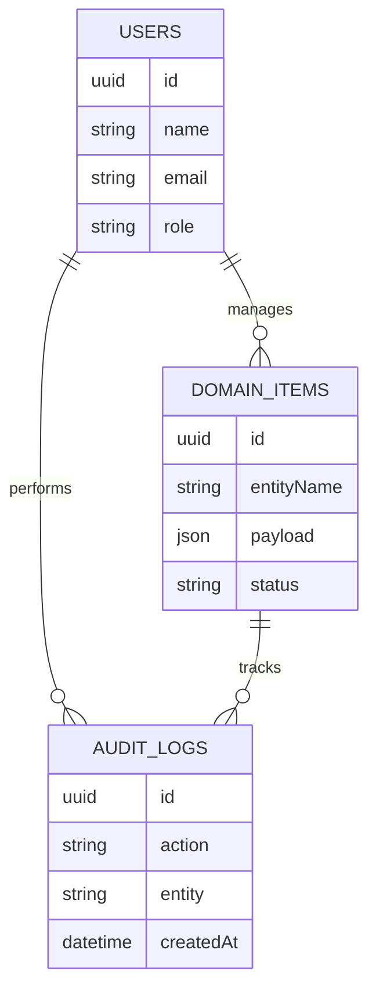

# ER Diagram

This ER diagram describes the main database relationships for Access Control Management System.

## Domain Mapping

The data model includes users, roles, audit logs, and domain collections for Access Control Identities, Access Control Access Requests, Access Control Devices, Access Control Incidents, Access Control Audit Logs. Key fields include Access Control Identities with Access Control Identity Code, Access Control Identity Name, Access Control Category, Security & Access Management Owner, Access Control Identity Status, Access Control Identity Code, Access Control Access Level, Access Control Department; Access Control Access Requests with Access Control AccessRequest Code, Access Control AccessRequest Name, Access Control Category, Security & Access Management Owner, Access Control AccessRequest Status, Access Control Request Number, Access Control Requested Area, Access Control Approval Status; Access Control Devices with Access Control Device Code, Access Control Device Name, Access Control Category, Security & Access Management Owner, Access Control Device Status, Access Control Device Code, Access Control Device Type, Access Control Location; Access Control Incidents with Access Control Incident Code, Access Control Incident Name, Access Control Category, Security & Access Management Owner, Access Control Incident Status, Access Control Incident Number, Access Control Severity, Access Control Reported Date; Access Control Audit Logs with Access Control AuditLog Code, Access Control AuditLog Name, Access Control Category, Security & Access Management Owner, Access Control AuditLog Status, Access Control Audit Number, Access Control Event Type, Access Control Risk Level.

## Entity Field Summary

- Access Control Identities: Access Control Identity Code, Access Control Identity Name, Access Control Category, Security & Access Management Owner, Access Control Identity Status, Access Control Identity Code, Access Control Access Level, Access Control Department
- Access Control Access Requests: Access Control AccessRequest Code, Access Control AccessRequest Name, Access Control Category, Security & Access Management Owner, Access Control AccessRequest Status, Access Control Request Number, Access Control Requested Area, Access Control Approval Status
- Access Control Devices: Access Control Device Code, Access Control Device Name, Access Control Category, Security & Access Management Owner, Access Control Device Status, Access Control Device Code, Access Control Device Type, Access Control Location
- Access Control Incidents: Access Control Incident Code, Access Control Incident Name, Access Control Category, Security & Access Management Owner, Access Control Incident Status, Access Control Incident Number, Access Control Severity, Access Control Reported Date
- Access Control Audit Logs: Access Control AuditLog Code, Access Control AuditLog Name, Access Control Category, Security & Access Management Owner, Access Control AuditLog Status, Access Control Audit Number, Access Control Event Type, Access Control Risk Level
