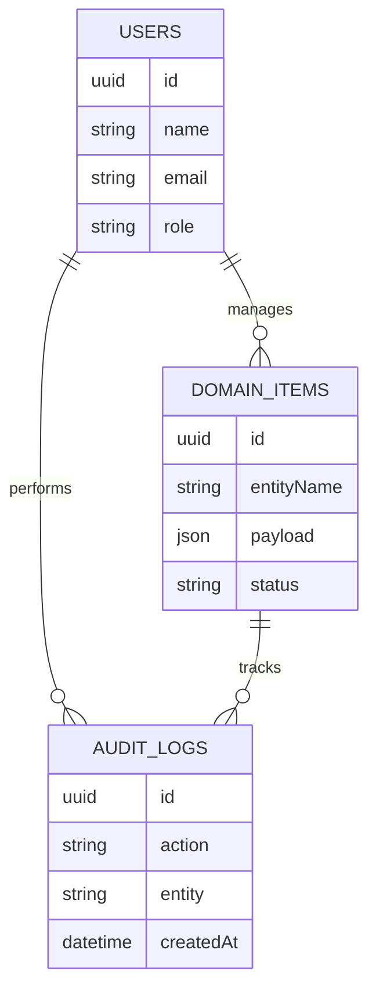
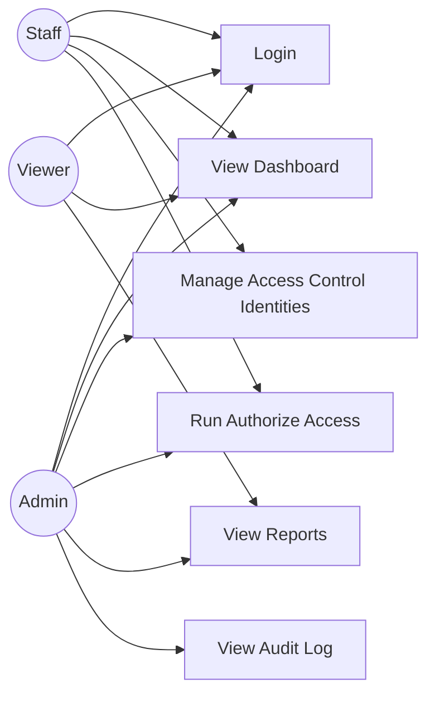
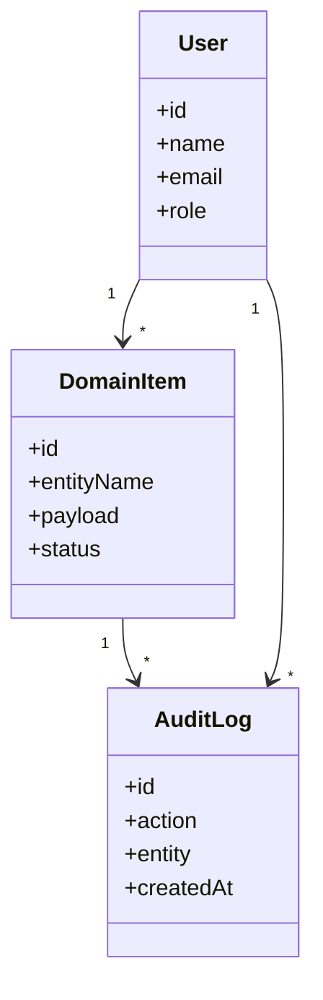
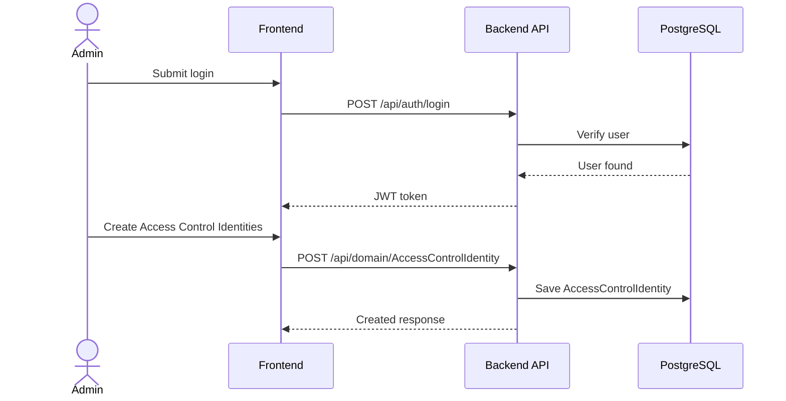

# Access Control Management System Project Report

Generated on 2026-04-27.

# Synopsis

## Project Title

Access Control Management System

## Project Category

Management

## Synopsis

Access Control Management System is a web-based management system designed to help users manage Access Control Identities, Access Control Access Requests, Access Control Devices, Access Control Incidents, and Access Control Audit Logs through a secure dashboard, structured CRUD workflows, reports, and audit history.

The project uses the Student Project Factory management template and adapts it for the access control domain. It includes domain-specific modules, sample seed data, dashboard statistics, API documentation, and demo credentials so students can run and explain the project confidently.

## Main Features

- Authorize Access: Authorize Access for access control with clear steps, ownership, and audit-ready status updates.
- Log Incident: Log Incident for access control with clear steps, ownership, and audit-ready status updates.
- Review Security Audit: Review Security Audit for access control with clear steps, ownership, and audit-ready status updates.

## Main Modules

- Dashboard
- Access Control Identities
- Access Control Access Requests
- Access Control Devices
- Access Control Incidents
- Access Control Audit Logs
- Authorize Access
- Log Incident
- Review Security Audit
- Reports
- Audit Trail

## Technology Stack

- Frontend: React + Tailwind
- Backend: .NET C#
- Database: PostgreSQL
- API Docs: Swagger
- Runtime: Docker Compose

## Domain Entities

- Access Control Identities: Access Control Identity Code, Access Control Identity Name, Access Control Category, Security & Access Management Owner, Access Control Identity Status, Access Control Identity Code, Access Control Access Level, Access Control Department
- Access Control Access Requests: Access Control AccessRequest Code, Access Control AccessRequest Name, Access Control Category, Security & Access Management Owner, Access Control AccessRequest Status, Access Control Request Number, Access Control Requested Area, Access Control Approval Status
- Access Control Devices: Access Control Device Code, Access Control Device Name, Access Control Category, Security & Access Management Owner, Access Control Device Status, Access Control Device Code, Access Control Device Type, Access Control Location
- Access Control Incidents: Access Control Incident Code, Access Control Incident Name, Access Control Category, Security & Access Management Owner, Access Control Incident Status, Access Control Incident Number, Access Control Severity, Access Control Reported Date
- Access Control Audit Logs: Access Control AuditLog Code, Access Control AuditLog Name, Access Control Category, Security & Access Management Owner, Access Control AuditLog Status, Access Control Audit Number, Access Control Event Type, Access Control Risk Level

## Domain Workflows

- Authorize Access: Open Request -> Verify Identity -> Assign Permission -> Approve Access
- Log Incident: Capture Incident -> Assign Severity -> Notify Officer -> Start Investigation
- Review Security Audit: Open Audit Log -> Check Risk -> Add Action -> Close Review

## Demo Access

```txt
Email: admin@example.com
Password: Admin@123
```


---

# Abstract

Access Control Management System is developed to simplify and digitize the daily operations of a access control management environment. Manual record keeping can cause delays, duplicate entries, weak reporting, and difficulty in tracking important activities. This system provides a centralized platform for managing Access Control Identities, Access Control Access Requests, Access Control Devices, Access Control Incidents, and Access Control Audit Logs with proper authentication, validation, reports, and audit logs.

The application follows a modular architecture with separate frontend, backend, and database layers. The frontend uses React + Tailwind to provide a clean student-friendly dashboard, while the backend uses .NET C# to expose REST APIs documented through Swagger. PostgreSQL stores structured data such as Access Control Identities, Access Control Access Requests, Access Control Devices, Access Control Incidents, and Access Control Audit Logs and configured domain workflows.

The project includes seed data based on domain records with code, title, description, and status, staff users and administrators, and Authorize Access, Log Incident, Review Security Audit. This makes the system easy to demonstrate during project reviews, viva sessions, and final-year submissions.


---

# Problem Statement

Organizations in the access control domain often manage Access Control Identities, Access Control Access Requests, Access Control Devices, Access Control Incidents, and Access Control Audit Logs using paper registers, spreadsheets, or disconnected tools. These methods become difficult to maintain as data volume increases.

## Existing Problems

- Data is scattered across multiple files or registers.
- Searching and updating Access Control Identities takes unnecessary time.
- Reports are prepared manually and may contain mistakes.
- Tracking Authorize Access and recent activity is difficult.
- There is no consistent audit history for important changes.
- Students and administrators cannot easily demonstrate a complete digital workflow.

## Proposed Problem Solution

Access Control Management System solves these issues by providing a centralized web application with login, dashboard statistics, CRUD modules, reports, seed data, and documented APIs. The system is designed so that users can manage Access Control Identities, Access Control Access Requests, Access Control Devices, Access Control Incidents, and Access Control Audit Logs in a structured and reliable way.


---

# Objectives

The main objective of Access Control Management System is to build a complete and easy-to-understand management system for the access control domain.

## Primary Objectives

- Provide secure admin login and protected dashboard access.
- Manage Access Control Identities, Access Control Access Requests, Access Control Devices, Access Control Incidents, and Access Control Audit Logs using CRUD operations.
- Store all project data in PostgreSQL.
- Provide dashboard statistics such as Active Identities, Pending Access, Open Incidents, and Audit Findings.
- Generate reports for monitoring and decision-making.
- Maintain audit logs for important user actions.
- Provide Swagger API documentation for backend testing.
- Include seed data for quick demonstration.

## Learning Objectives

- Understand full-stack project structure.
- Learn REST API design using .NET C#.
- Practice database modeling and relationships.
- Build reusable frontend components.
- Use Docker Compose for local deployment.
- Prepare documentation required for college submission.


---

# Major Project Profile

## Project Category

Final Year Major Project

## Complexity

advanced

## Problem Depth

Access Control Management System is positioned as a final-year major project.

## Advanced Modules

- Advanced module enrichment not available.

## Major Workflows

- Workflow enrichment not available.

## Analytics Reports

- Analytics enrichment not available.

## Config-Driven Generation Scope

Generation mode: deterministic-config

- Domain configuration was used for modules, workflows, seed data, and documentation.

## Acceptance Tests

- Standard validation checks apply.


---

# System Requirements

## Functional Requirements

- The system shall allow admin login using demo credentials.
- The system shall display dashboard statistics for Access Control Management System.
- The system shall allow users to create, view, update, and delete Access Control Identities, Access Control Access Requests, Access Control Devices, Access Control Incidents, and Access Control Audit Logs.
- The system shall support searching and filtering Access Control Identities.
- The system shall provide reports for key project data.
- The system shall maintain audit logs for important actions.
- The system shall expose REST APIs with Swagger documentation.

## Non-Functional Requirements

- The system should be easy to run locally.
- The UI should be simple and student-friendly.
- API responses should be structured and consistent.
- The database should support project data and domain-specific seed data.
- The project should be portable through Docker Compose.
- Documentation should be clear enough for viva and submission.

## Users

- Admin
- Staff or operator
- Viewer or report user


---

# Software Requirements

## Development Software

- Node.js 20 or later
- pnpm package manager
- Docker Desktop or Docker Engine
- PostgreSQL, provided through Docker Compose or local configuration
- VS Code, Cursor, or another code editor
- Git

## Application Software

- Frontend: React + Tailwind
- Backend framework: .NET C#
- Database: PostgreSQL
- API documentation: Swagger
- Authentication: JWT-based auth structure

## Browser Requirement

Any modern browser such as Chrome, Edge, Firefox, or Safari can be used to access the frontend and Swagger documentation.


---

# Hardware Requirements

## Minimum Requirements

- Processor: Dual-core processor
- RAM: 4 GB
- Storage: 2 GB free space
- Network: Localhost access for frontend, backend, and database services

## Recommended Requirements

- Processor: Quad-core processor
- RAM: 8 GB or more
- Storage: 5 GB free space
- Docker-compatible development machine

## Deployment Environment

For college demonstration, the project can run on a laptop using Docker Compose. A separate production server is not required for basic project submission.


---

# Module Description

Access Control Management System is divided into modules so each part of the system has a clear responsibility.

## Core Modules

- Dashboard: Shows Access Control Identities, Access Control Access Requests, Access Control Devices, Access Control Incidents, and Access Control Audit Logs statistics, insight panels, and domain workflow status.
- Access Control Identities: Manages access control identities with access control identity code, access control identity name, access control category, security & access management owner, access control identity status, access control identity code, access control access level, access control department.
- Access Control Access Requests: Manages access control access requests with access control accessrequest code, access control accessrequest name, access control category, security & access management owner, access control accessrequest status, access control request number, access control requested area, access control approval status.
- Access Control Devices: Manages access control devices with access control device code, access control device name, access control category, security & access management owner, access control device status, access control device code, access control device type, access control location.
- Access Control Incidents: Manages access control incidents with access control incident code, access control incident name, access control category, security & access management owner, access control incident status, access control incident number, access control severity, access control reported date.
- Access Control Audit Logs: Tracks important actions performed in the system.
- Authorize Access: Supports workflow steps such as Open Request, Verify Identity, Assign Permission, Approve Access.
- Log Incident: Supports workflow steps such as Capture Incident, Assign Severity, Notify Officer, Start Investigation.
- Review Security Audit: Tracks important actions performed in the system.
- Reports: Provides summary views for Access Control Identities, Access Control Access Requests, Access Control Devices, Access Control Incidents, and Access Control Audit Logs and configured workflows.
- Audit Trail: Tracks important actions performed in the system.

## Domain Entities

- Access Control Identities: Access Control Identity Code, Access Control Identity Name, Access Control Category, Security & Access Management Owner, Access Control Identity Status, Access Control Identity Code, Access Control Access Level, Access Control Department
- Access Control Access Requests: Access Control AccessRequest Code, Access Control AccessRequest Name, Access Control Category, Security & Access Management Owner, Access Control AccessRequest Status, Access Control Request Number, Access Control Requested Area, Access Control Approval Status
- Access Control Devices: Access Control Device Code, Access Control Device Name, Access Control Category, Security & Access Management Owner, Access Control Device Status, Access Control Device Code, Access Control Device Type, Access Control Location
- Access Control Incidents: Access Control Incident Code, Access Control Incident Name, Access Control Category, Security & Access Management Owner, Access Control Incident Status, Access Control Incident Number, Access Control Severity, Access Control Reported Date
- Access Control Audit Logs: Access Control AuditLog Code, Access Control AuditLog Name, Access Control Category, Security & Access Management Owner, Access Control AuditLog Status, Access Control Audit Number, Access Control Event Type, Access Control Risk Level

## Domain Workflows

- Authorize Access: Open Request -> Verify Identity -> Assign Permission -> Approve Access
- Log Incident: Capture Incident -> Assign Severity -> Notify Officer -> Start Investigation
- Review Security Audit: Open Audit Log -> Check Risk -> Add Action -> Close Review

## Dashboard Statistics

- Active Identities
- Pending Access
- Open Incidents
- Audit Findings

## Unique Domain Features

- Authorize Access: Authorize Access for access control with clear steps, ownership, and audit-ready status updates.
- Log Incident: Log Incident for access control with clear steps, ownership, and audit-ready status updates.
- Review Security Audit: Review Security Audit for access control with clear steps, ownership, and audit-ready status updates.

## Seed Data Theme

- Primary Data: domain records with code, title, description, and status
- People / Owners: staff users and administrators
- Workflows: Authorize Access, Log Incident, Review Security Audit


---

# ER Diagram

This ER diagram describes the main database relationships for Access Control Management System.



## Domain Mapping

The data model includes users, roles, audit logs, and domain collections for Access Control Identities, Access Control Access Requests, Access Control Devices, Access Control Incidents, Access Control Audit Logs. Key fields include Access Control Identities with Access Control Identity Code, Access Control Identity Name, Access Control Category, Security & Access Management Owner, Access Control Identity Status, Access Control Identity Code, Access Control Access Level, Access Control Department; Access Control Access Requests with Access Control AccessRequest Code, Access Control AccessRequest Name, Access Control Category, Security & Access Management Owner, Access Control AccessRequest Status, Access Control Request Number, Access Control Requested Area, Access Control Approval Status; Access Control Devices with Access Control Device Code, Access Control Device Name, Access Control Category, Security & Access Management Owner, Access Control Device Status, Access Control Device Code, Access Control Device Type, Access Control Location; Access Control Incidents with Access Control Incident Code, Access Control Incident Name, Access Control Category, Security & Access Management Owner, Access Control Incident Status, Access Control Incident Number, Access Control Severity, Access Control Reported Date; Access Control Audit Logs with Access Control AuditLog Code, Access Control AuditLog Name, Access Control Category, Security & Access Management Owner, Access Control AuditLog Status, Access Control Audit Number, Access Control Event Type, Access Control Risk Level.

## Entity Field Summary

- Access Control Identities: Access Control Identity Code, Access Control Identity Name, Access Control Category, Security & Access Management Owner, Access Control Identity Status, Access Control Identity Code, Access Control Access Level, Access Control Department
- Access Control Access Requests: Access Control AccessRequest Code, Access Control AccessRequest Name, Access Control Category, Security & Access Management Owner, Access Control AccessRequest Status, Access Control Request Number, Access Control Requested Area, Access Control Approval Status
- Access Control Devices: Access Control Device Code, Access Control Device Name, Access Control Category, Security & Access Management Owner, Access Control Device Status, Access Control Device Code, Access Control Device Type, Access Control Location
- Access Control Incidents: Access Control Incident Code, Access Control Incident Name, Access Control Category, Security & Access Management Owner, Access Control Incident Status, Access Control Incident Number, Access Control Severity, Access Control Reported Date
- Access Control Audit Logs: Access Control AuditLog Code, Access Control AuditLog Name, Access Control Category, Security & Access Management Owner, Access Control AuditLog Status, Access Control Audit Number, Access Control Event Type, Access Control Risk Level


---

# UML Diagrams

## Use Case Diagram



## Class Diagram



## Sequence Diagram




---

# API Documentation

The backend exposes REST APIs for Access Control Management System. Swagger documentation is available at:

```txt
http://localhost:18080/api/docs
```

## Authentication

| Method | Endpoint | Purpose |
| --- | --- | --- |
| POST | `/api/auth/login` | Login and receive an access token |

## Common APIs

| Method | Endpoint | Purpose |
| --- | --- | --- |
| GET | `/api/health` | Check backend health |
| GET | `/api/dashboard/stats` | Fetch dashboard statistics |
| GET | `/api/reports/summary` | View report summary |
| GET | `/api/audit-log` | View audit history |

## Domain APIs

| Method | Endpoint | Purpose |
| --- | --- | --- |
| GET | `/api/domain/AccessControlIdentity` | List Access Control Identities |
| POST | `/api/domain/AccessControlIdentity` | Create Access Control Identities entry |
| GET | `/api/domain/AccessControlAccessRequest` | List Access Control Access Requests |
| POST | `/api/domain/AccessControlAccessRequest` | Create Access Control Access Requests entry |
| GET | `/api/domain/AccessControlDevice` | List Access Control Devices |
| POST | `/api/domain/AccessControlDevice` | Create Access Control Devices entry |
| GET | `/api/domain/AccessControlIncident` | List Access Control Incidents |
| POST | `/api/domain/AccessControlIncident` | Create Access Control Incidents entry |
| GET | `/api/domain/AccessControlAuditLog` | List Access Control Audit Logs |
| POST | `/api/domain/AccessControlAuditLog` | Create Access Control Audit Logs entry |

## Demo Login

```json
{
  "email": "admin@example.com",
  "password": "Admin@123"
}
```


---

# Test Cases

| Test Case ID | Scenario | Steps | Expected Result |
| --- | --- | --- | --- |
| TC-001 | Admin login | Enter valid demo credentials and submit | Dashboard opens successfully |
| TC-002 | Invalid login | Enter wrong password and submit | Error message is displayed |
| TC-003 | View dashboard | Login and open dashboard | Statistics for Active Identities, Pending Access, Open Incidents, and Audit Findings are shown |
| TC-004 | Create AccessControlIdentity | Open Access Control Identities page and submit valid form | New AccessControlIdentity entry is created |
| TC-005 | Edit record | Update an existing Access Control Identities item | Updated values are saved |
| TC-006 | Delete record | Delete an existing item after confirmation | Item is removed or marked inactive |
| TC-007 | Search Access Control Identities | Search by domain fields | Matching Access Control Identities are displayed |
| TC-008 | View reports | Open reports page | Summary report loads correctly |
| TC-009 | Swagger check | Open `/api/docs` | Swagger documentation is visible |
| TC-010 | Health check | Call `/api/health` | API returns healthy status |

## Domain-Specific Test Focus

The tester should verify that seed data correctly represents domain records with code, title, description, and status, staff users and administrators, and Authorize Access, Log Incident, Review Security Audit.


---

# Future Scope

Access Control Management System can be extended with more advanced features after the base project is complete.

## Possible Enhancements

- Add role-based permissions for each module.
- Add advanced analytics and charts.
- Add PDF and Excel export for reports.
- Add email or SMS notifications.
- Add file upload support for documents and receipts.
- Add multi-branch or multi-location support.
- Add mobile-friendly progressive web app behavior.
- Add automated backups for PostgreSQL.
- Add approval workflows for important Authorize Access actions.

## Domain-Specific Enhancements

- Authorize Access: Authorize Access for access control with clear steps, ownership, and audit-ready status updates.
- Log Incident: Log Incident for access control with clear steps, ownership, and audit-ready status updates.
- Review Security Audit: Review Security Audit for access control with clear steps, ownership, and audit-ready status updates.


---

# Conclusion

Access Control Management System provides a complete full-stack management project for the access control domain. It solves common problems related to manual record keeping, slow searching, weak reporting, and lack of centralized data.

The system includes secure login, dashboard statistics, CRUD modules, reports, audit logs, seed data, API documentation, and Docker-based setup. The project also helps students understand frontend development, backend APIs, database design, authentication, deployment, and project documentation.

Overall, Access Control Management System is suitable for college demonstrations, viva preparation, and final-year project submission because it combines practical domain features with a clear and explainable technical architecture.

