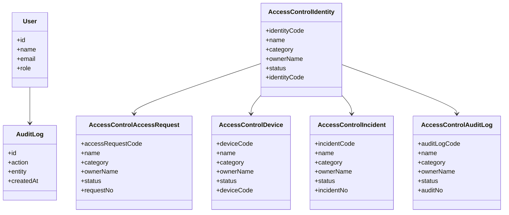

# Class Diagram

```mermaid
classDiagram
  class User {
    +id
    +name
    +email
    +role
  }
  class AccessControlIdentity {
    +identityCode
    +name
    +category
    +ownerName
    +status
    +identityCode
  }
  class AccessControlAccessRequest {
    +accessRequestCode
    +name
    +category
    +ownerName
    +status
    +requestNo
  }
  class AccessControlDevice {
    +deviceCode
    +name
    +category
    +ownerName
    +status
    +deviceCode
  }
  class AccessControlIncident {
    +incidentCode
    +name
    +category
    +ownerName
    +status
    +incidentNo
  }
  class AccessControlAuditLog {
    +auditLogCode
    +name
    +category
    +ownerName
    +status
    +auditNo
  }
  class AuditLog {
    +id
    +action
    +entity
    +createdAt
  }
  AccessControlIdentity --> AccessControlAccessRequest
  AccessControlIdentity --> AccessControlDevice
  AccessControlIdentity --> AccessControlIncident
  AccessControlIdentity --> AccessControlAuditLog
  User --> AuditLog
```
