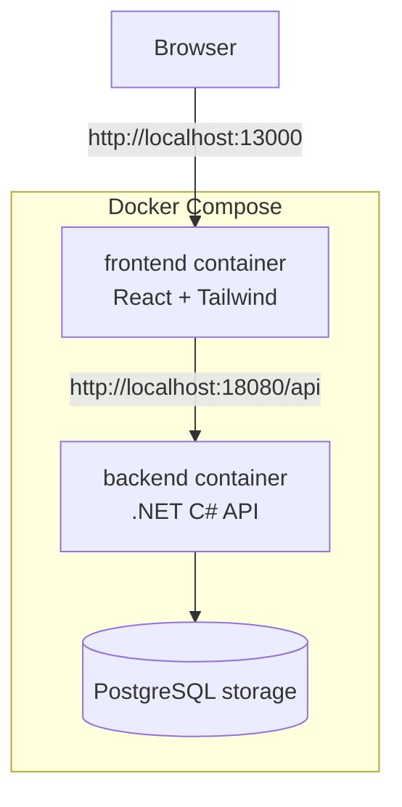

# Deployment Diagram

```mermaid
flowchart TB
  subgraph Docker Compose
    Frontend[frontend container\nReact + Tailwind]
    Backend[backend container\n.NET C# API]
    DB[(PostgreSQL storage)]
  end
  Browser[Browser] -->|http://localhost:13000| Frontend
  Frontend -->|http://localhost:18080/api| Backend
  Backend --> DB
```
