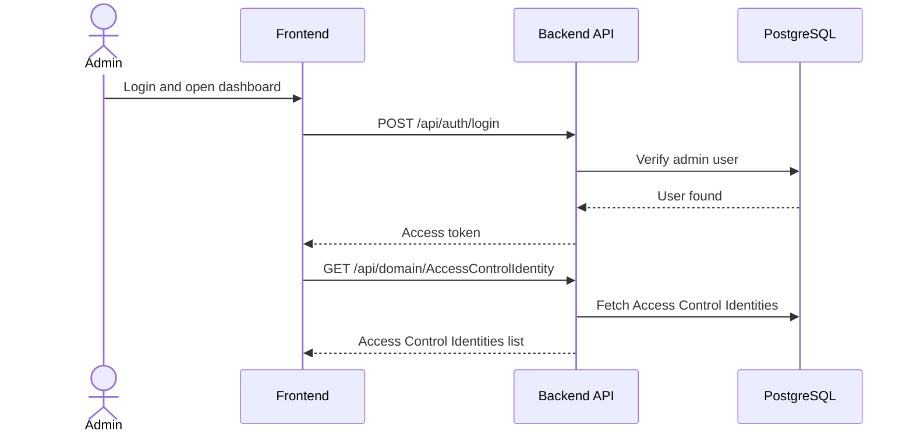

# Sequence Diagram

```mermaid
sequenceDiagram
  actor Admin
  participant UI as Frontend
  participant API as Backend API
  participant DB as PostgreSQL
  Admin->>UI: Login and open dashboard
  UI->>API: POST /api/auth/login
  API->>DB: Verify admin user
  DB-->>API: User found
  API-->>UI: Access token
  UI->>API: GET /api/domain/AccessControlIdentity
  API->>DB: Fetch Access Control Identities
  API-->>UI: Access Control Identities list
```
