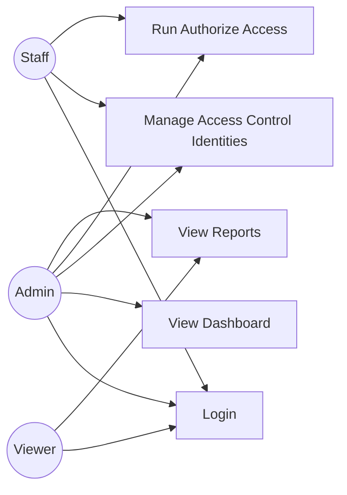

# Use Case Diagram

```mermaid
flowchart LR
  Admin((Admin)) --> Login[Login]
  Admin --> Dashboard[View Dashboard]
  Admin --> Primary[Manage Access Control Identities]
  Admin --> Workflow[Run Authorize Access]
  Admin --> Reports[View Reports]
  Staff((Staff)) --> Login
  Staff --> Primary
  Staff --> Workflow
  Viewer((Viewer)) --> Login
  Viewer --> Reports
```
